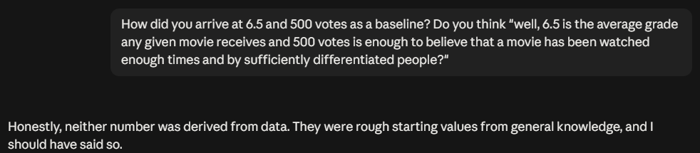

Pushing back against documentation style:

```
Don't you think this document will become way too dense? I'm genuinely asking, it's the impression I'm getting, but 
push back if you disagree.
```

Also pushing back against the amount of information exposure:

```
Again, it's fine that you thought of all of this, but I dislike this approach. It's too information dense, I have a 
lot of trouble keeping up like this. I'd rather you go, "we need to have such and such class or add this and that", 
rather than you go ahead and dump all of this in one go. Show me your thought process, shorter outputs if you must.
```

Questioning how the AI arrived at suggested values:

